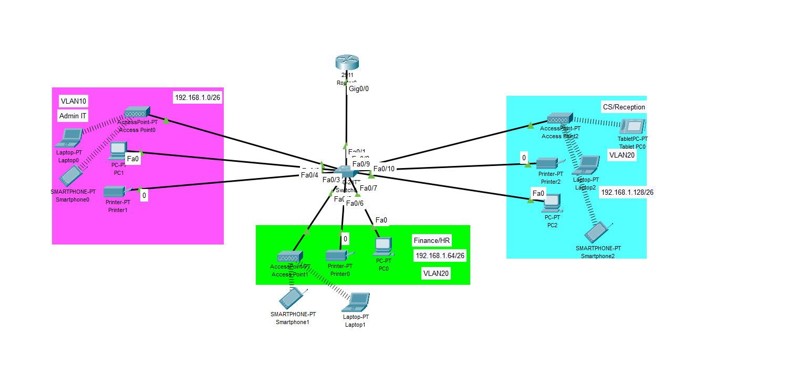

# Cisco Packet Tracer – VLAN och Router-on-a-stick



## Syfte
Segmentera nätverket i tre VLAN, aktivera inter-VLAN-routing via router-on-a-stick och tilldela adresser med DHCP.

## Topologi
- Router: Cisco 2911
- Switch: Cisco WS-C2960-24TT-L
- VLAN och IP-plan
  - VLAN10 Admin IT: 192.168.1.0/26, GW 192.168.1.1
  - VLAN20 Finance/HR: 192.168.1.64/26, GW 192.168.1.65
  - VLAN30 Reception: 192.168.1.128/26, GW 192.168.1.129

## Konfiguration – Router
```shell
enable
configure terminal

! Subinterfaces
interface GigabitEthernet0/0
 no shutdown
!
interface GigabitEthernet0/0.10
 encapsulation dot1Q 10
 ip address 192.168.1.1 255.255.255.192
!
interface GigabitEthernet0/0.20
 encapsulation dot1Q 20
 ip address 192.168.1.65 255.255.255.192
!
interface GigabitEthernet0/0.30
 encapsulation dot1Q 30
 ip address 192.168.1.129 255.255.255.192

! DHCP
service dhcp
ip dhcp excluded-address 192.168.1.1
ip dhcp excluded-address 192.168.1.65
ip dhcp excluded-address 192.168.1.129

ip dhcp pool Admin-Pool
 network 192.168.1.0 255.255.255.192
 default-router 192.168.1.1
 dns-server 8.8.8.8
!
ip dhcp pool Finance-Pool
 network 192.168.1.64 255.255.255.192
 default-router 192.168.1.65
 dns-server 8.8.8.8
!
ip dhcp pool Reception-Pool
 network 192.168.1.128 255.255.255.192
 default-router 192.168.1.129
 dns-server 8.8.8.8

end
write memory
```

## Konfiguration – Switch
```shell
enable
configure terminal

! VLAN
vlan 10
 name Admin
vlan 20
 name Finance
vlan 30
 name Reception

! Trunk mot router
interface FastEthernet0/1
 switchport mode trunk
 switchport trunk allowed vlan 10,20,30

! Accessportar
interface range FastEthernet0/2 - 4
 switchport mode access
 switchport access vlan 10
!
interface range FastEthernet0/5 - 7
 switchport mode access
 switchport access vlan 20
!
interface range FastEthernet0/8 - 10
 switchport mode access
 switchport access vlan 30

end
write memory
```

## Verifiering
```shell
! Router
show ip interface brief
show ip dhcp pool
show ip dhcp binding
show ip dhcp conflict

! Switch
show vlan brief
show interfaces trunk
show ip interface brief
```

## Resultat
- Klienter i respektive VLAN får adresser via DHCP enligt planen
- Ping mellan VLAN fungerar via router-on-a-stick
- Trunk bär VLAN 10,20,30